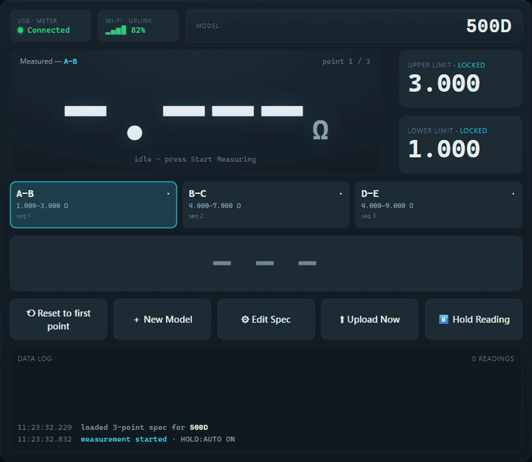
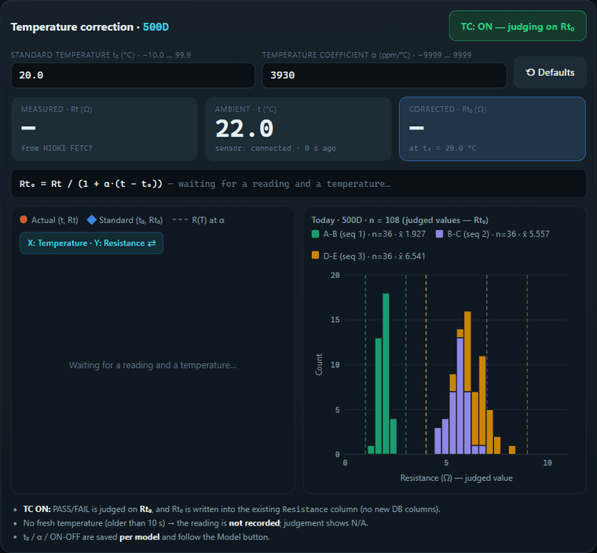

# Hioki Data Logger

A Python GUI application that reads resistance measurements from HIOKI multimeters via USB/RS-232 serial, judges each reading against per-model pass/fail limits, and automatically uploads results to a Microsoft SQL Server database. Designed for manufacturing quality-control kiosks — including a Raspberry Pi 5 touchscreen deployment.



*QC Panel — the 500D sequence (A-B → B-C → D-E) auto-advancing, with a failing part injected
mid-run. Recorded from the interactive [HIOKI_UI_mockup.html](HIOKI_UI_mockup.html) (simulated
meter, sensor and database — open it in any browser to try it).*

## Features

- Auto-detects HIOKI devices on available COM ports
- Real-time resistance measurement polling (500 ms interval)
- **Multi-point spec sequences** — a model can define an ordered list of measurement points (e.g. `A-B = 1–3 Ω`, `B-C = 4–7 Ω`, `D-E = 4–9 Ω`); the app judges each reading against the *current* point's range, records which point it was, then **auto-advances** to the next point and wraps back to point 1 after the last
- **In-app model registration** — a touchscreen dialog registers a new model or edits an existing spec; on confirm it writes the point sequence to the `resistance_spec` table
- **Point cards** — tappable cards let the operator jump directly to any point in the sequence (touch-friendly alternative to Prev/Next)
- **On-screen keyboard & numpad** — full QWERTY keyboard (with a Shift toggle) for model/point names and a numeric keypad for limits; both accept USB barcode-scanner input
- **Temperature Correction (TC)** — an RS485 ambient-temperature sensor corrects each reading to a standard temperature (`Rt₀ = Rt / (1 + α·(t − t₀))`); per-model t₀/α, PASS/FAIL judged on Rt₀, live chart of the actual vs. standard point
- **Hold / Release display toggle** — choose whether the big measurement value **holds** the last reading in standby (probes lifted) or **releases to 0**; the choice persists across restarts
- **Audio feedback** — plays a Thai-language voice alert on every PASS (`ResistancePass_TH.mp3`) or FAIL (`ResistanceOver_TH.mp3`)
- **Barcode scanner input** — USB HID scanner auto-sets the active model; all entry methods share the same unified decode logic (AIM Code 39 Extended, `$`-delimited, and plain text)
- **Model change log** (`model_changes.csv`) — audit trail of every model switch; used to auto-recover the last model after a crash or reboot
- Local CSV logging (daily files, no data loss on DB failure)
- **Offline-resilient uploads** — measurement rows queue to `pending_uploads.json` and spec writes queue to `pending_specs.csv` when the server is unreachable; both flush automatically with exponential backoff
- **Upload Now button** — force-flush the pending queue to the DB without waiting for the retry timer
- **Startup schema guard** — on launch the app checks the DB is reachable and warns if the multi-point columns are missing (i.e. migration not yet applied)
- **Serial hardware-hang recovery** — a bounded write timeout plus a liveness watchdog detect a wedged USB link, show "⚠ Serial hardware hang — reconnecting", and rebuild the connection **without closing the app**
- Automatic reconnection with exponential backoff on serial errors
- Process watchdog (D-state + heartbeat staleness) that restarts a truly hung app
- Deployable as systemd services on Raspberry Pi, with automatic landscape touchscreen rotation

## Requirements

### Python

**Python 3.9+** with PySide6:

```
PySide6       # includes QtMultimedia (QMediaPlayer) via pyside6-addons
pyserial      # provides serial.tools.list_ports
pyodbc
watchdog
requests
```

> Install via `pip install -r requirements.txt`  
> On Raspberry Pi use the setup script — it installs system packages first (see [Raspberry Pi Deployment](#raspberry-pi-deployment)).

### System (Raspberry Pi / Debian)

```bash
sudo apt install python3-serial python3-venv python3-pip \
                 unixodbc-dev libglib2.0-0 libdbus-1-3 libxcb-cursor-dev \
                 gstreamer1.0-plugins-base gstreamer1.0-plugins-good \
                 gstreamer1.0-alsa gstreamer1.0-libav \
                 x11-xserver-utils xinput
```

> The GStreamer packages are required for `QMediaPlayer` to decode and play MP3 files on Linux.  
> `x11-xserver-utils` (xrandr) and `xinput` are used to rotate the touchscreen to landscape at startup.

### Database

Microsoft SQL Server with **ODBC Driver 18 for SQL Server** installed.

### Hardware

HIOKI resistance meter with SCPI support connected via USB or RS-232.  
Tested models: RM3544-01, RM3545, RM3542, DM7276, DM7275, IM7580A.

Touchscreen deployment tested on a Raspberry Pi 5 with an ED-HMI3010-101C 10.1" 1280×800 panel.

## Setup

### 1. Install dependencies

```bash
pip install -r requirements.txt
```

### 2. Configure database connection

Edit [insert_resistance2db.py](insert_resistance2db.py) and update the connection parameters:

```python
server   = '172.18.72.16'     # SQL Server IP or hostname
database = 'ENGINEER_DB'
username = 'engineering_user'
password = 'Engineering@user'
```

### 3. Apply the database migration

Run the migration once against `ENGINEER_DB` to create the spec table and add the
per-reading traceability columns. Both scripts are re-runnable (guarded existence checks).

```bash
# resistance_spec master table + Point/Seq/LowerLimit/UpperLimit columns on resistance
sqlcmd -S 172.18.72.16 -d ENGINEER_DB -U engineering_user -P 'Engineering@user' \
       -i migrations/001_multipoint_spec.sql

# Optional: seed the 500D example sequence (A-B / B-C / D-E)
sqlcmd -S 172.18.72.16 -d ENGINEER_DB -U engineering_user -P 'Engineering@user' \
       -i migrations/002_seed_500D.sql
```

Resulting schema:

```sql
-- Master spec: one row per measurement point of a model's sequence
CREATE TABLE resistance_spec (
    Model      VARCHAR(100) NOT NULL,
    Seq        INT          NOT NULL,   -- 1-based order in the sequence
    PointName  VARCHAR(50)  NOT NULL,   -- e.g. 'A-B'
    LowerLimit FLOAT        NOT NULL,
    UpperLimit FLOAT        NOT NULL,
    Active     BIT          NOT NULL DEFAULT 1,
    UpdatedAt  DATETIME     NOT NULL DEFAULT getdate(),
    CONSTRAINT PK_resistance_spec PRIMARY KEY (Model, Seq)
);

-- Measurement table gains a nullable per-reading snapshot
-- (Point, Seq, LowerLimit, UpperLimit) so a historical OK/NG stays explainable
-- even after a spec is later edited.
CREATE TABLE resistance (
    Timestamp  DATETIME DEFAULT GETDATE(),
    Resistance FLOAT,
    Status     NVARCHAR(10),   -- 'OK', 'NG', or 'N/A'
    Model      NVARCHAR(100),
    [Date]     DATE,
    [Time]     TIME,
    Point      VARCHAR(50) NULL,
    Seq        INT         NULL,
    LowerLimit FLOAT       NULL,
    UpperLimit FLOAT       NULL
);
```

> A model with **no** point sequence still works: it is judged against the single
> `lower_limit`/`upper_limit` in `gui_mode5_config.json` and inserts `NULL` point columns.

### 4. Configure measurement limits

Single-range limits are stored in `gui_mode5_config.json` and managed at runtime via the
**Model** button. Multi-point specs are managed via the **＋ New Model** / **⚙ Edit Spec**
dialog and cached locally per model. To pre-set a single-range limit manually:

```json
{
  "current_model": "MODEL_A",
  "hold_previous": true,
  "models": {
    "MODEL_A": { "lower_limit": 0.01, "upper_limit": 14.0 }
  }
}
```

## Running

```bash
python main.py
```

The application starts full-screen, auto-detects the connected HIOKI device, and begins polling once a device is found.

## Testing Audio Feedback (Without a Device)

Two keyboard shortcuts let you test the PASS/FAIL sounds without a connected HIOKI meter:

| Shortcut | Effect |
|---|---|
| **Ctrl+P** | Simulate PASS — green button + plays `ResistancePass_TH.mp3` |
| **Ctrl+F** | Simulate FAIL — red button + plays `ResistanceOver_TH.mp3` |
| **Ctrl+T** | Type a **simulated ambient temperature** (no sensor attached) — feeds the Temperature Correction tab; goes stale after 10 s like a real reading |

These shortcuts work at any time while the application is running.

## Setting the Model

Three ways to set the active product model:

| Method | How |
|---|---|
| **Barcode scanner** | Point a USB HID scanner at the product label — decoded and applied instantly |
| **Model button** | Click the large **Model** button and type or paste any supported format (plain name, `$`-delimited raw, or AIM Code 39 raw) |
| **Auto-prompt** | If no model is set when a stable reading is recorded, the app prompts automatically |

The last used model is saved to `gui_mode5_config.json` and restored on the next startup. If that file is missing or empty, the app recovers the model from `model_changes.csv`.

### Barcode Decode Logic

All model-entry paths (scanner, Model button, auto-prompt, and the registration dialog's
name fields) run through the same unified decode function in the order below:

| Priority | Format | Detection | Example input | Result |
|---|---|---|---|---|
| 1 | **Dollar-delimited** | contains `$` | `FOD123$1SRG14R(BRK)-MM$15` | `SRG14R(BRK)-MM` |
| 2 | **AIM Code 39 Extended** | contains `/[A-Z]` escape pair | `?H60AGV/HFCWR/I-MM-4FHX-B5/D...` | `H60AGV(FCWR)-MM-4FHX-B5` |
| 3 | **Plain text** | no `$` or `/X` patterns | `SRG14R-MM-4FHX-B5` | `SRG14R-MM-4FHX-B5` |

#### AIM Code 39 Extended details

1. Strips the leading check-digit character
2. Converts `/H` → `(`, `/I` → `)`, `/L` → `/`, etc. (see full table in [barcodereader.md](barcodereader.md))
3. Stops at `/D` (field separator)

This means you can scan a label, or paste the raw barcode string into the Model button dialog — both produce the same decoded model name.

## Multi-Point Spec Sequences

A model may define an ordered sequence of measurement points, each with its own range.
Example for model `500D`:

| Seq | Point | Lower | Upper |
|-----|-------|-------|-------|
| 1 | A-B | 1 Ω | 3 Ω |
| 2 | B-C | 4 Ω | 7 Ω |
| 3 | D-E | 4 Ω | 9 Ω |

**During measurement**, the app judges each stable reading against the current point's
range, writes a row with `Point`/`Seq`/`LowerLimit`/`UpperLimit`, then auto-advances to the
next point — wrapping back to point 1 after the last. The operator can also tap a **point
card** to jump directly to any point, or reset to point 1.

**Registering / editing a spec** — the **＋ New Model** button (or **⚙ Edit Spec** for the
current model) opens a touchscreen dialog. Enter the model name and each point's name and
limits (limits use 2 decimals), then confirm:

- If the server is reachable, the sequence is written to `resistance_spec` (an atomic
  delete-then-insert of that model's rows) and cached locally.
- If the server is unreachable, the spec is queued to `pending_specs.csv` and flushed later,
  the same way measurement uploads are queued.

Specs are cached per model in `gui_mode5_config.json` under `models[model]["points"]`, so
the device keeps judging correctly offline.

## Measurement Display: Hold vs. Release

The large resistance value has a toggle button controlling what it shows while the meter is
in **standby** (probes lifted, so the meter reports over-range or `OL`):

| Mode | Button | Behavior in standby |
|---|---|---|
| **Hold** (default) | `⏸ Hold Reading` | Keeps showing the last measured value |
| **Release** | `⤓ Release to 0` | Resets the display to `0` |

A live reading always overwrites the display on the next poll, so switching modes never
loses a real measurement. The choice is saved in `gui_mode5_config.json` (`hold_previous`)
and restored on startup.

## Temperature Correction (TC)

The **Temperature Correction** tab converts the resistance measured at the ambient
temperature into its value at a standard temperature — the same TC function as the HIOKI
meter, done in the app with an external temperature sensor:



*TC on while the ambient temperature rises from 22 to 34 °C: the Actual point slides along
R(T), Rt₀ stays put at t₀ = 20 °C, and each recorded reading joins its seq in the histogram.
Recorded from [HIOKI_UI_mockup.html](HIOKI_UI_mockup.html).*

```
Rt₀ = Rt / (1 + α_t₀ · (t − t₀))        α in ppm/°C  (3930 ppm/°C = 0.003930 /°C)
```

| Symbol | Meaning | Source / range |
|---|---|---|
| `Rt` | Measured resistance (Ω) | HIOKI `FETC?` |
| `t` | Current ambient temperature (°C) | RS485 temperature sensor |
| `t₀` | Standard temperature (°C) | per model, −10.0 … 99.9 (default 20.0) |
| `α_t₀` | Temperature coefficient at t₀ (ppm/°C) | per model, −9999 … 9999 (default 3930 = copper) |
| `Rt₀` | Corrected resistance (Ω) | result |

**Worked example:** Rt = 12.345 Ω at t = 26.4 °C, t₀ = 20.0 °C, α = 3930 ppm/°C →
`12.345 / (1 + 0.003930 × 6.4) = 12.042 Ω`.

**When TC is ON for the active model:**
- PASS/FAIL is judged on **Rt₀** against the model's limits (limits are treated as values at t₀).
- **Rt₀ is written into the existing `Resistance` column** (CSV + DB) — no extra columns; the
  Data Log line also shows the raw Rt and t for on-screen traceability.
- The big *Measured* value shows Rt₀ (title `Measured → 20.0 °C (TC)`).
- **If there is no fresh temperature (older than 10 s) the reading is *not recorded*** —
  the Data Log shows `⚠ TC on — no fresh temperature…`, judgement is N/A. A raw Rt saved in
  the same column would be indistinguishable from a corrected one.

**The tab** (all touch): TC ON/OFF switch, `t₀` and `α` fields (numpad with ± key), *Defaults*,
live readouts (Rt · t · Rt₀), the formula with the actual numbers substituted, and a chart:
the **Actual (t, Rt)** point (orange circle) and the **Standard (t₀, Rt₀)** point (blue
diamond) on the dashed line `R(T) = Rt₀·(1 + α(T − t₀))`. *Chart axes* swaps between
X = Temperature / Y = Resistance (default) and X = Resistance / Y = Temperature.

Both charts use **fixed axes** — temperature 0–50 °C, resistance from the model's whole spec —
so only the points move between measurements (an out-of-range value stretches an axis just
enough to stay visible).

Beside it, a **resistance histogram** shows today's recorded (judged) values for the current
model, **stacked and coloured per seq**, with each seq's lower/upper limits as dashed lines in
the same colour and a legend giving name, n and mean. It is loaded from today's daily CSV when
the model loads (old and new CSV layouts both work) and grows live with every recorded reading.
With TC on the values are Rt₀ — readings logged while TC was off are raw Rt, and the CSV does not
record which, so avoid toggling TC mid-day if you rely on the histogram.

Settings are **per model** (`models[<model>]["tc"]` in `gui_mode5_config.json`) and follow the
model automatically; a model with no saved settings starts with TC **OFF**.

> ⚠ Make sure the **meter's own TC function is OFF**, otherwise `FETC?` is already corrected
> and gets corrected twice.

### Temperature sensor setup (Raspberry Pi 5)

The sensor is an RS485 / Modbus RTU device on UART0 (`/dev/ttyAMA0`), read by
[rs485_temperature_monitor.py](rs485_temperature_monitor.py). Its register map is a
**placeholder** until confirmed on the real sensor:

1. Enable UART0: add `dtoverlay=uart0` to `/boot/firmware/config.txt`, reboot.
2. Install the extras into the venv: `.venv/bin/pip install pymodbus matplotlib`
   (both are in `requirements.txt`, so `setup_services.sh` installs them too).
3. Find the temperature register and scale:
   ```bash
   cd ~/Hioki_data_logger
   .venv/bin/python rs485_temperature_monitor.py --scan --slave-id 1
   ```
   Pick the register whose value matches the room temperature (×0.1 or ×0.01).
4. Put the result in `gui_mode5_config.json` (any key left out uses the default):
   ```json
   "temp_sensor": {
     "enabled": true, "port": "/dev/ttyAMA0", "baud": 9600,
     "slave_id": 1, "register": 0, "scale": 0.1, "poll_interval": 1.0
   }
   ```
5. Restart the app — the tab's *Ambient t* card should show the live value and `Sensor: connected`.

HIOKI auto-detect **skips the sensor port**, so its `*IDN?` probe never lands on the RS485 bus.
Without `pymodbus` (e.g. developing on Windows) the app runs normally and the tab shows
*Sensor unavailable* — use **Ctrl+T** to type a temperature by hand.

## Uploads & Offline Resilience

Every stable reading is logged to the daily CSV immediately, then handed to the background
upload manager. If the DB is unreachable the record is kept safe and retried:

| Queue | File | Contents |
|---|---|---|
| Measurements | `pending_uploads.json` | Readings awaiting DB insert (survives restarts) |
| Specs | `pending_specs.csv` | Registered/edited specs awaiting DB write |

Retries use exponential backoff. A header banner shows how many readings are waiting, and
the **⬆ Upload Now** button force-flushes both queues immediately without waiting for the
timer. Old-format queue entries (written before the multi-point fields existed) still flush
correctly — missing fields insert as `NULL`.

## Project Structure

```
├── main.py                    # Main GUI application (PySide6)
├── usb_rs.py                  # Serial communication wrapper (bounded read/write timeouts)
├── insert_resistance2db.py    # MSSQL insert + spec read/write + schema check
├── db_upload_manager.py       # Background upload queue + spec queue with retry
├── ui_UI_Resistance.py        # Qt UI code (PySide6)
├── UI_Resistance.ui           # Qt Designer UI definition
├── numpad_dialog.py           # On-screen numeric keypad (limits, ± for TC)
├── keyboard_dialog.py         # On-screen QWERTY keyboard (model/point names)
├── temp_correction.py         # TC formula + Temperature Correction tab (chart)
├── rs485_temperature_monitor.py  # RS485/Modbus temperature reader (+ --scan tool)
│
├── migrations/
│   ├── 001_multipoint_spec.sql  # Create resistance_spec + extend resistance
│   └── 002_seed_500D.sql        # Seed the 500D example sequence
│
├── ResistancePass_TH.mp3      # Audio alert played on PASS result
├── ResistanceOver_TH.mp3      # Audio alert played on FAIL result
│
├── gui_mode5_config.json      # Per-model limits + point cache + last model + hold_previous
├── model_changes.csv          # Audit log of every model switch (auto-created)
├── pending_uploads.json       # DB retry queue for readings (auto-created)
├── pending_specs.csv          # DB retry queue for spec writes (auto-created)
├── heartbeat.txt              # Liveness heartbeat for the watchdog (auto-created)
├── YYYYMMDD.csv               # Daily measurement log (auto-created)
│
├── HIOKI_UI_mockup.html       # Interactive UI mockup (QC panel, Register Model, TC)
├── docs/media/                # README demo GIFs (recorded from the mockup)
├── barcodereader.md           # Barcode decode specification
├── setup_services.sh          # Raspberry Pi: install services + touch rotation
├── hioki-app.service          # Systemd unit — main app
├── hioki-watchdog.service     # Systemd unit — watchdog
├── watchdog.sh                # Watchdog: D-state + heartbeat staleness restart
└── requirements.txt           # Python package list
```

## Raspberry Pi Deployment

Copy (or clone) the project to `~/Hioki_data_logger/`, then run the setup script once:

```bash
# Fresh clone (the path must be exactly ~/Hioki_data_logger)
cd ~
git clone -b MSW --single-branch https://github.com/natn2014/Hioki_data_logger.git
cd Hioki_data_logger
rm -rf .venv                    # drop any committed Windows venv before building the Linux one

chmod +x setup_services.sh
sudo ./setup_services.sh
sudo reboot                     # so the touchscreen rotation loads
```

The script will:

1. Install system packages via `apt` (serial, ODBC libs, XCB cursor, xrandr/xinput)
2. Create a `.venv` virtual environment with `--system-site-packages`
3. Install all Python packages from `requirements.txt`
4. **Verify every module imports without error** — exits with a clear failure message if any import fails
5. Configure landscape touchscreen rotation (see below)
6. Write and enable two systemd services
7. Start both services and show their status

### Touchscreen rotation

The panel ships in portrait (kiosk) orientation. The setup script configures a landscape
rotation that survives reboot:

- Writes `/etc/X11/xorg.conf.d/90-hioki-touch-rotate.conf` (an `InputClass` that maps touch
  coordinates for any touchscreen).
- Generates a `rotate-display.sh` that runs as an `ExecStartPre` of `hioki-app.service`. It
  waits (retry loop) until the display output is ready, rotates the screen via `xrandr`,
  applies the touch matrix `0 -1 1 1 0 0 0 0 1` per touchscreen via `xinput`, and verifies
  the result is landscape.

If rotation ever reverts, check:

```bash
journalctl -u hioki-app.service -b | grep rotate-display
```

### Services

| Service | Role |
|---|---|
| `hioki-app.service` | Runs `main.py`, rotates the display, waits for X11, auto-restarts on crash |
| `hioki-watchdog.service` | Restarts the app if it hangs (D-state ≥ 30 s, or heartbeat stale) |

### Useful Commands

```bash
sudo systemctl status  hioki-app.service
sudo systemctl restart hioki-app.service
sudo systemctl stop    hioki-app.service
journalctl -u hioki-app.service -f
tail -f ~/Hioki_data_logger/watchdog.log
```

## Data Logging

| File | Contents |
|---|---|
| `YYYYMMDD.csv` | One row per stable reading: `Timestamp`, `Resistance`, `Status`, `Model`, `Point`, `Seq`, `LowerLimit`, `UpperLimit`, `Date`, `Time`, `DB_Status` |
| `model_changes.csv` | One row per model event: `Timestamp`, `Action`, `Previous_Model`, `New_Model`, `Source` |
| `pending_uploads.json` | Reading upload retry queue — survives app restarts |
| `pending_specs.csv` | Spec write retry queue — survives app restarts |

### Model Change Actions

| Action | Meaning |
|---|---|
| `STARTUP` | App started with this model (from config or recovery) |
| `CHANGE` | Model switched — source is `barcode`, `manual`, or `prompt` |
| `RESTORE` | Model recovered from `model_changes.csv` after config was missing |

## Connection Resilience

| Mechanism | Detail |
|---|---|
| Bounded serial I/O | Read and **write** timeouts so a wedged USB path raises instead of blocking forever |
| Serial hardware-hang recovery | UI-thread liveness watchdog detects a stalled poll worker and rebuilds the connection on a fresh handle — the app stays open |
| Exponential backoff | Reconnect delay: 1 s → 1.5 s → … → 60 s max |
| `*IDN?` heartbeat | Every 30 s to detect silent device failures |
| Consecutive timeout limit | 3 timeouts → reconnect |
| Poll thread crash guard | Unexpected exception emits reconnect signal |
| Upload retry queues | Readings and specs persist to disk and retry with backoff |
| Watchdog (Linux) | Restarts the app after 30 s in D-state, or if the heartbeat file goes stale |

> **Note on D-state:** a thread truly stuck in Linux uninterruptible sleep (D-state) cannot
> be killed from user space. The in-app recovery therefore does not try to un-stick it — it
> **prevents** the common cause (write timeout), **detects** the stall, and **rebuilds** the
> connection on a new handle. A hardware USB reset (root-only) is intentionally out of scope.

## SCPI Command Reference

See [README_COMMANDS.md](README_COMMANDS.md) for the full list of HIOKI SCPI commands.
For the multi-point feature design notes, see [MSW_update.md](MSW_update.md).
